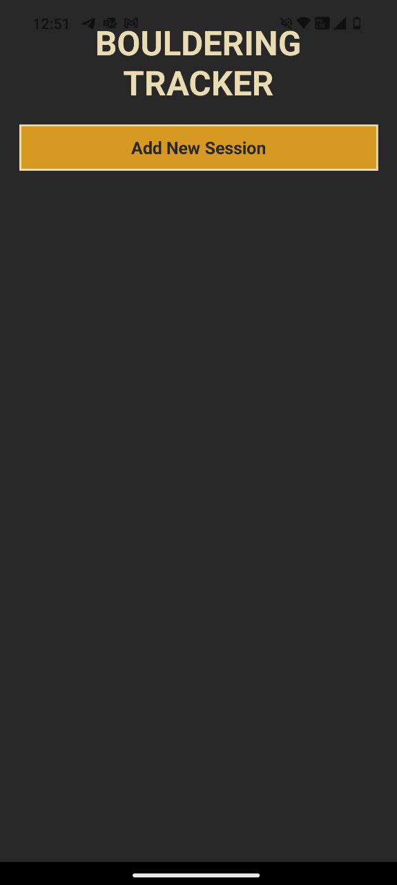
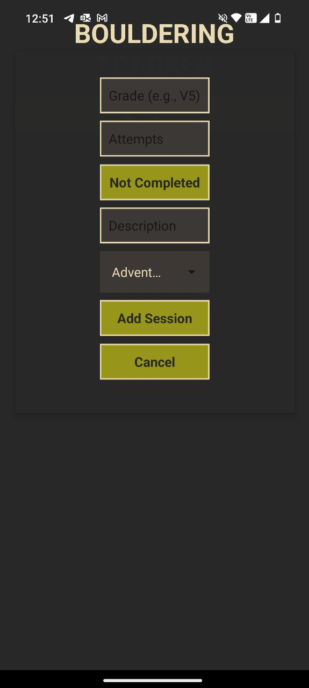
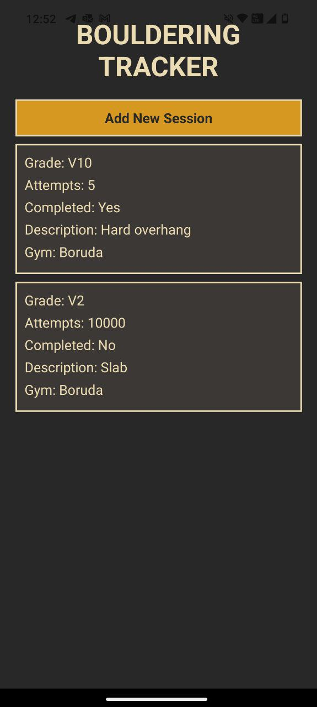

# `Bode`

A simple bouldering session tracking app written in [React Native](https://reactnative.dev/) and powered by [Expo](https://expo.dev/).

## Screenshots

<div style="display: flex; justify-content: space-between;">
  
  
  
</div>

## Usage

First run.

```console
$ cd src/bode-app
$ npm i
$ npx expo start -c --tunnel
```

Then scan the QR code with the [Camera app](https://docs.expo.dev/versions/latest/sdk/camera/) on IOS or the [Expo Go](https://play.google.com/store/apps/details?id=host.exp.exponent&hl=en_SG) app on Android.