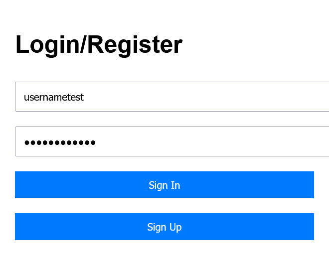
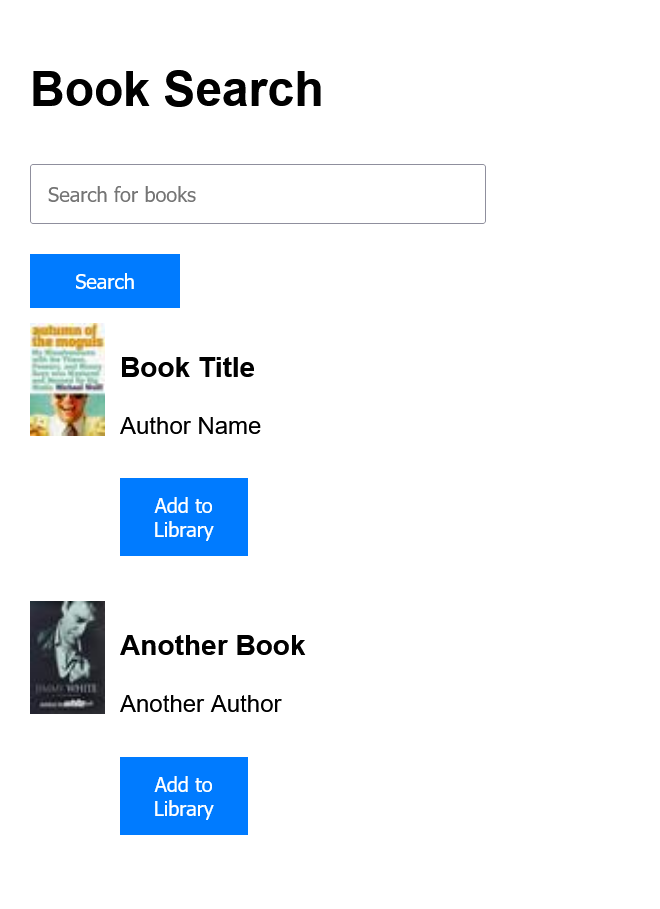
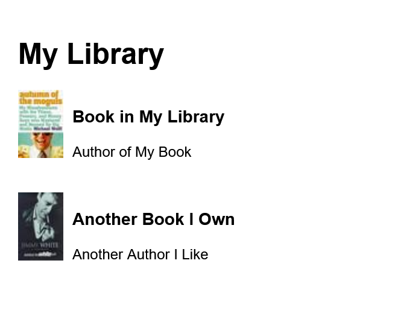
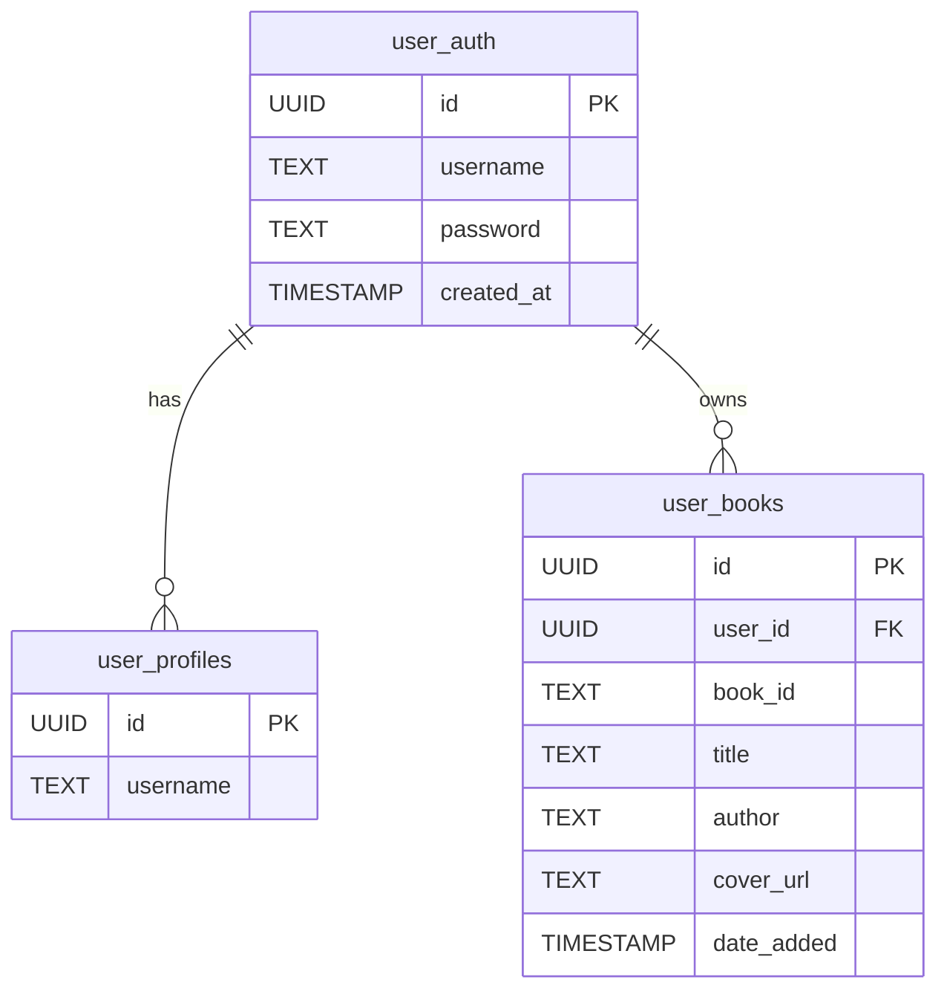
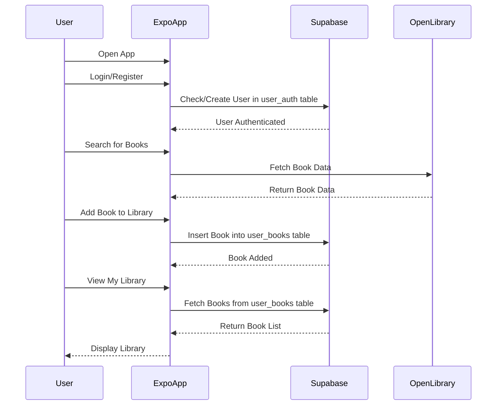

# `Illumi`

Personal booktracking app written in [React Native](https://reactnative.dev/) and powered by [Expo](https://expo.dev/).

Stores data with [Supabase](https://supabase.com/).

<div align="center">
    
</div>

## Screenshots

<div style="display: flex; justify-content: space-between;">
  
  
  
</div>

## Usage

First create a Supabase database with the [`create.sql`](./src/create.sql) and place your Supabase URL and Supabase anonymous public key within [`src/illumi-app/src/lib/supabase.ts`](./src/illumi-app/src/lib/supabase.ts).

```ts
const supabaseUrl = "XXX";
const supabaseAnonKey = "XXX";
```

Then run.

```console
$ cd src/illumi-app
$ npm i
$ npx expo start -c --tunnel
```

Then scan the QR code with the [Camera app](https://docs.expo.dev/versions/latest/sdk/camera/) on IOS or the [Expo Go](https://play.google.com/store/apps/details?id=host.exp.exponent&hl=en_SG) app on Android.

## Architecture

### DB



### Overview

