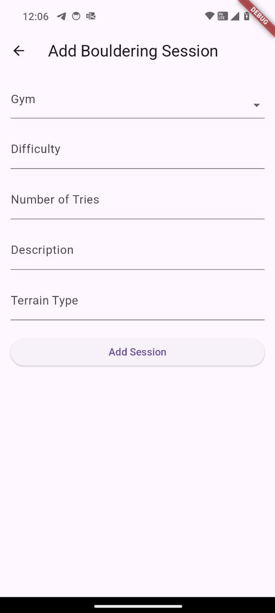
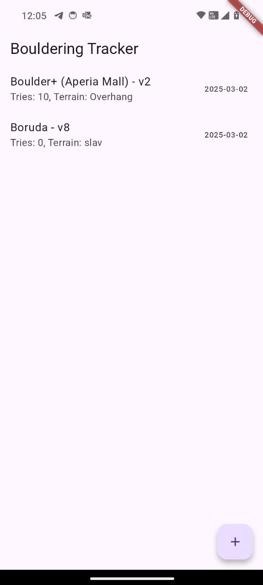

# Bouldering session tracking app

Basic Flutter app to track your bouldering sessions

## Screenshots

<div style="display: flex; justify-content: space-between;">
  
  
</div>

## Usage

1. Connect phone to laptop via USB.
2. Allow USB debugging on phone.
3. Run the below.

```console
$ cd boulder_tracker_app
$ flutter clean
$ flutter pub get
$ flutter run
```

4. Open the demo on phone.