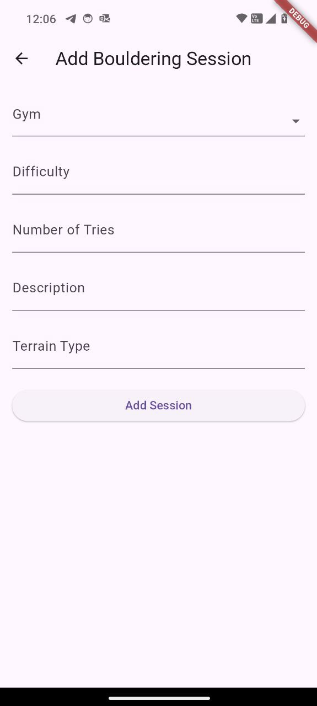
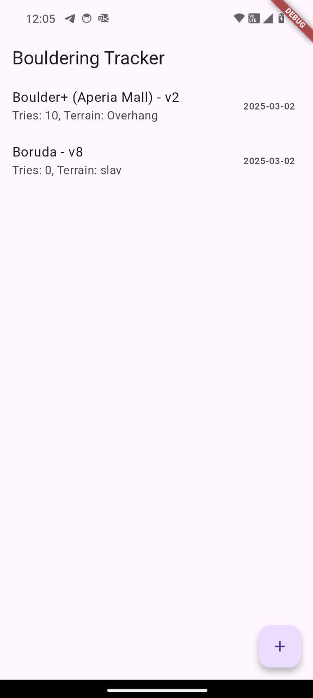

# Bouldering session tracking app

Basic Flutter app to track your bouldering sessions

## Usage

1. Connect phone to laptop via USB.
2. Allow USB debugging on phone.
3. Run the below.

```console
$ cd template
$ flutter run
```

4. Open the demo on phone.



