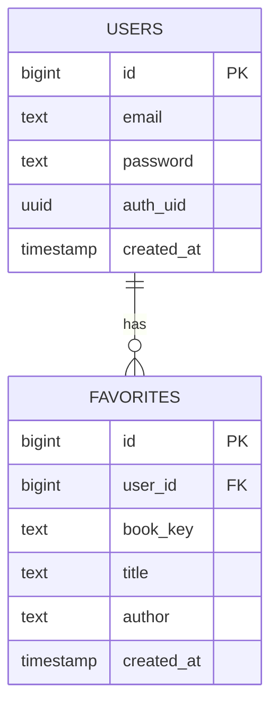
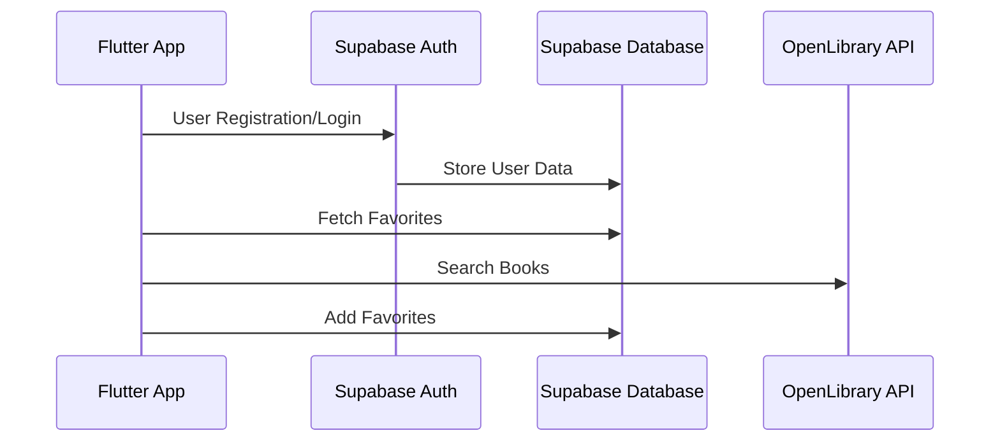

# Library App

A highly insecure, simple book catalogue app that calls [Open Library API](https://openlibrary.org/) and stores data with [Supabase](https://supabase.com/).

Made to experience writing a Flutter app that interacts with a DB.


## Usage

1. Connect phone to laptop via USB.
2. Allow USB debugging on phone.
3. Create a Supabase DB with the schema under `create.sql`.
4. Add your supabase credentials to a `.env` file in project root.

```env
SUPABASE_URL=XXX
SUPABASE_ANON_KEY=XXX
```

5. Run the below.

```console
$ cd illumi2
$ flutter run
```

6. Open the demo on phone.

## Architecture 

### DB



### Overview

