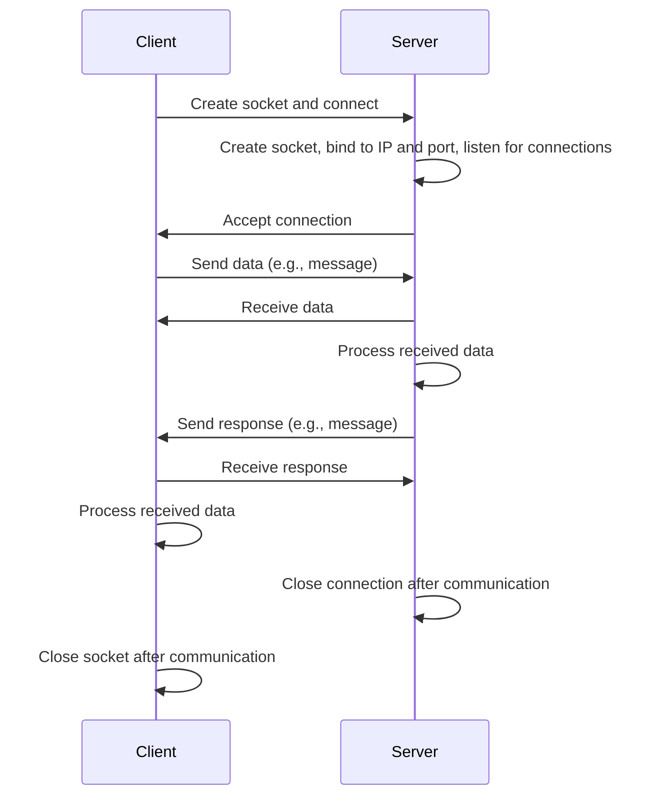
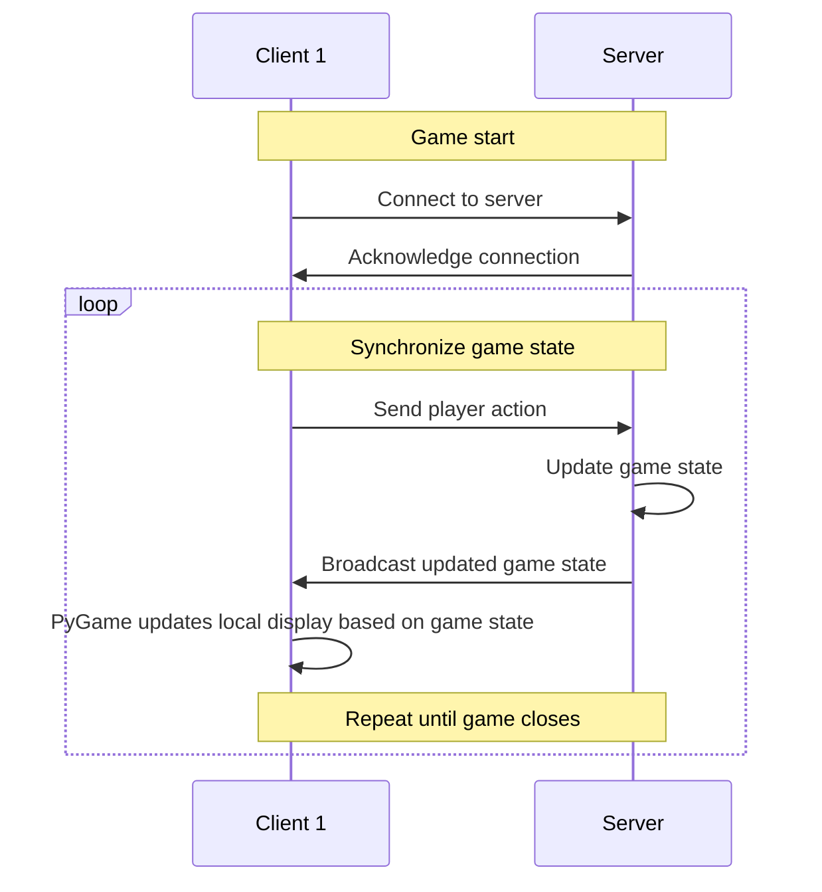

# Research

Things learnt.

## Engines

* [Godot](https://godotengine.org/)

## Libraries

* [Sockets](https://docs.python.org/3/library/socket.html) for networking
* [PyGame](https://www.pygame.org/news) for frontend and game logic

## Sockets

### Definition

Socket
* Programming interface that allows data to be sent and received between 2 programs over a network
* Done by establishing and maintaining server-client connection 
* Consists of the machine's IP address on the network *(client or server)* and a port number *(differentiates multiple services running on the same machine)*, creating a unique identifier where a communication channel can be opened
* Types of sockets

### Socket types

1. Stream sockets
    * TCP sockets *(Transmission Control Protocol)*
    * Guarantees delivery of data and manages the connection between the client and server
    * Used for reliable, connection-oriented communication

2. Datagram Sockets 
    * UDP sockets *(User Datagram Protocol)* 
    * Faster than TCP but does not guarantee data delivery
    * Connectionless communication where data is sent without establishing a connection

### Applying sockets in client-server models

* Client requests a connection to the server and sends data
* Server waits for incoming client connections and listens for data

## Server-client architecture

`Gunshu` relies on the standard server-client architecture for its game state.

### Alternatives

Networking alternatives.

* [Sockets](https://docs.python.org/3/library/socket.html) provides low-level networking functionality between clients and a server, requires handling complexities like connections and synchronizing state manually
* [SocketIO](https://python-socketio.readthedocs.io/en/latest/) useful for real-time applications and has built-in support for web-based multiplayer communication, commonly used with web-based games and apps by supporting event-based communication
* [Twisted](https://twistedmatrix.com/trac/) provides high-level networking functionality and is an asynchronous networking framework with a steep learning curve that can handle multiple connections and protocols including SSL support
* [PyNet](https://pypi.org/project/pynetworking/) provides a simple network multiplayer layer for PyGame

Game logic alternatives.

* [Arcade](https://api.arcade.academy/en/latest/) is a modern Python framework for creating 2D games with a more Pythonic API, focusing on simplicity and performance
* [Pyglet](https://pyglet.readthedocs.io/en/latest/) is a cross-platform library for creating 2D games, handling graphics, sounds, and windowing, with a flexible and minimalistic design
* [Godot (Python Bindings)](https://github.com/touilleMan/godot-python) allows using Python with the Godot engine, providing a full-fledged game development environment for 2D and 3D games
* [Cocos2d for Python](http://python.cocos2d.org/) offers a simple and flexible framework for building 2D games with support for sprites, animations, and physics
* [Bevy](https://bevyengine.org/) provides a modular, data-driven game engine for 2D and 3D games, focused on performance and Rust's strengths
* [Amethyst](https://www.amethyst.rs/) is an ECS-based game engine for complex, real-time applications, designed for scalability in larger games
* [Macroquad](https://github.com/not-fl3/macroquad) is a lightweight framework for rapid 2D game development, great for prototyping and small projects
* [Phaser](https://phaser.io/) is a popular 2D game framework for web-based games, providing extensive tools for handling sprites, animations, and physics
* [Three.js](https://threejs.org/) is a powerful 3D graphics library for creating interactive 3D games and visualizations directly in the browser
* [Babylon.js](https://www.babylonjs.com/) is a feature-rich 3D engine for building immersive web games with support for VR and AR experiences
* [Unreal Engine](https://www.unrealengine.com/) is a high-performance engine used for AAA 3D games, offering advanced graphics and scripting in C++
* [SDL](https://www.libsdl.org/) provides low-level access to graphics, audio, and input for C/C++ developers building custom game engines or simpler 2D games
* [Cocos2d-x](https://www.cocos.com/en/) is a C++ framework for 2D games, widely used in mobile game development for its cross-platform capabilities
* [Godot Engine](https://godotengine.org/) is an open-source game engine that supports 2D and 3D development, with native scripting in GDScript, C#, and C++

## Art

* [Pixel-It](https://giventofly.github.io/pixelit/) - Turn any image into pixel art
* [Images to Sprite Sheet Generator](https://codeshack.io/images-sprite-sheet-generator/) - Self-explanatory
* [Piskel](https://www.piskelapp.com/) - Free online spritesheet editor
