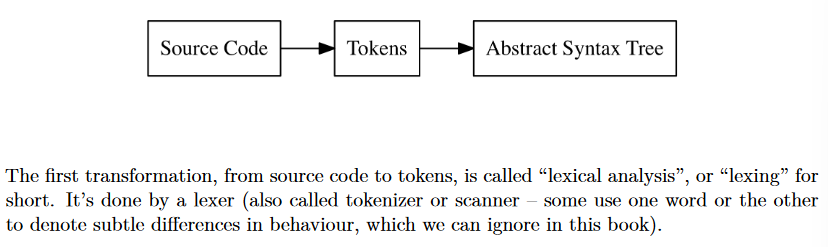
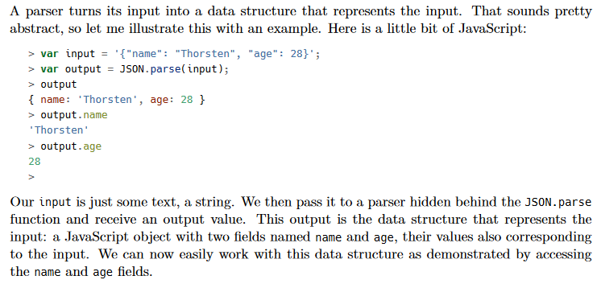
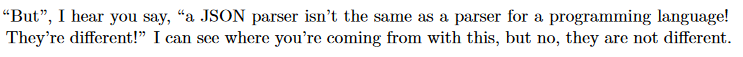
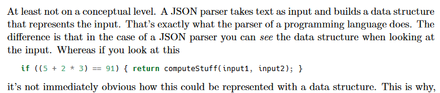
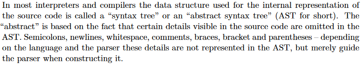

# `Definitions`

* **REPL**: Read-Eval-Print Loop available in most programming languages
    1. Read: REPL reads user-inputted code
    2. Eval: REPL evaluates the entered code and executes it
    3. Print: REPL prints result of evaluation if applicable
    4. Loop: REPL returns to Read step
* **token**: recognised building blocks of the language (keywords, identifiers, operators, literals etc)
* **lexer**: scanner that breaks down user code into meaningful tokens via lexical analysis

* **parser**: analyzes the stream of tokens according to grammer rules of the language (defined within the [ebnf file](https://www.infragistics.com/help/winforms/ig-spe-ebnf-file-format-overview)) to validate the syntax of the source code (aka syntactic analysis), often by building a hierarchical structure like an AST

* **AST**: abstract syntax tree (tree data structure) that codifies the relationships between different tokens

* **parser generator**: tools (eg. YACC, Bison, ANTLER) that produce parsers as output when fed with a formal description of the language (eg. BNF, EBNF)
* **internal object system**: operations and data structures that represent values and objects within the interpreter
* **evaluator**: interprets and executes code within the AST per operations and data structures within the internal object system
* **tree-walking interpreter**: interpreter that traverses the AST and interprets it