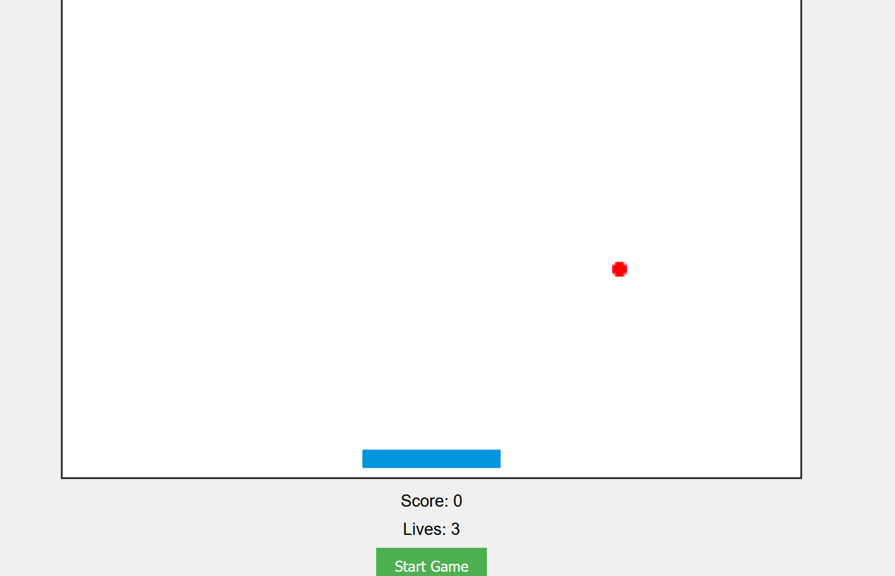

# [Brickbreaker](https://en.wikipedia.org/wiki/Brick_Breaker) with [HTML Canvas API](https://developer.mozilla.org/en-US/docs/Web/API/Canvas_API)

> [!WARNING]
> This is more than slightly broken. I won't be fixing it. This was a nice forage into writing more complex code and rendering with Canvas API though.

1. Run `python3 -m http.server 8000` or `http-server -p 8000` in the desired subfolder
2. See [`localhost:8000`](http://localhost:8000) in your browser

