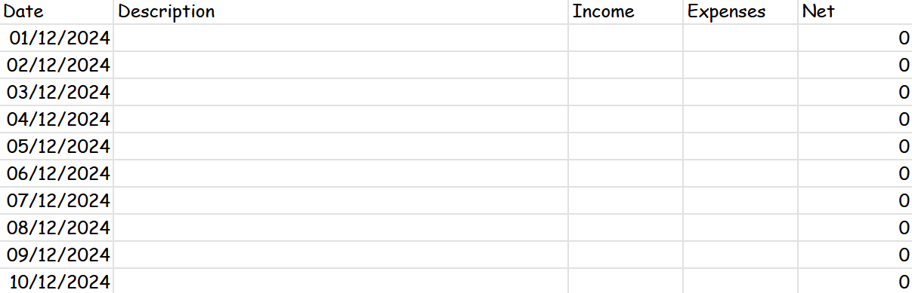
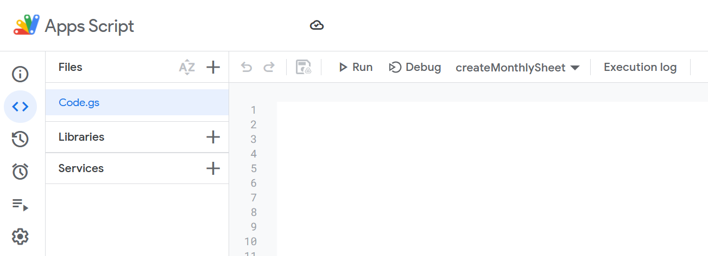
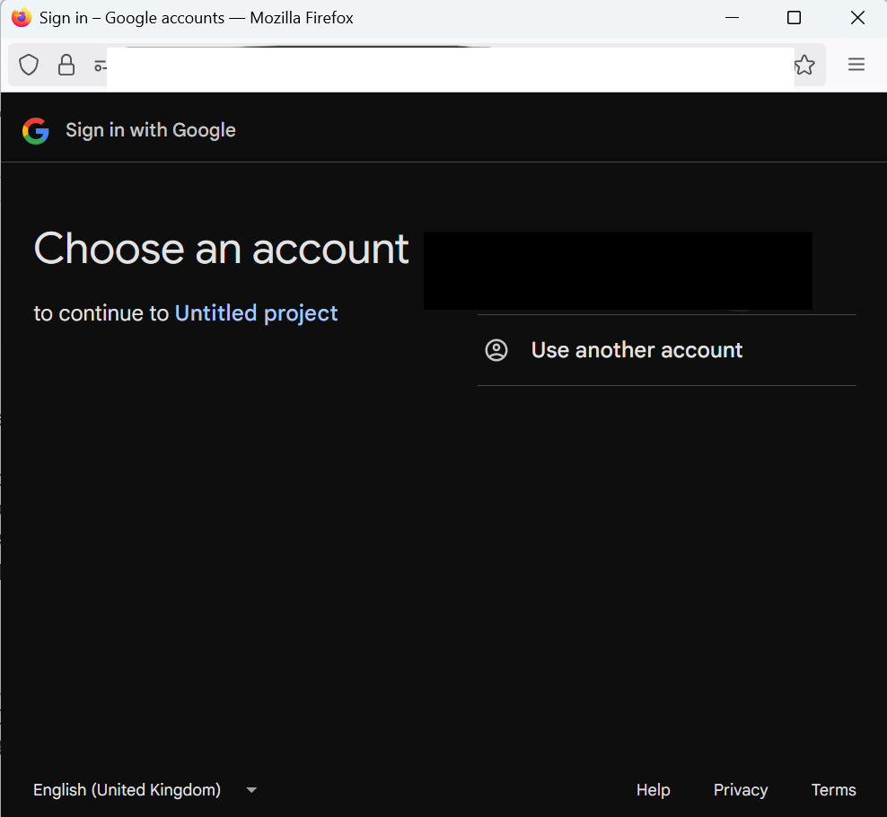
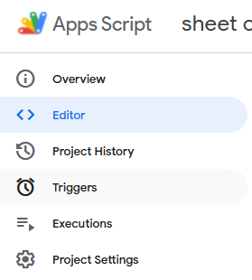
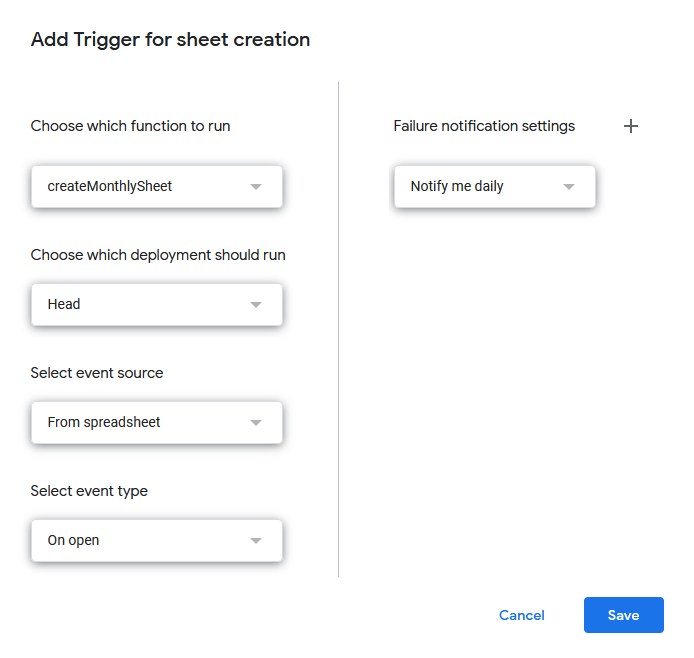

# `google sweet`

Automatically generate monthly expense sheets.

## Usage

1. Open [google suite](https://workspace.google.com/) application.
2. Select `Extensions > Apps Script`.

3. Replace the code in `Code.gs`.

5. `Ctrl + s` to save the project.
6. Select `Run`.
7. Select `OK` to give permissions.

8. Choose a Google Account to associate with the script.

9. Select `Show Advanced > Go to project_name (unsafe)`.

10. Select `Allow`.

11. Select `Triggers` in the left sidebar.

12. Select `+ Add Trigger` at the bottom right corner.
13. Configure the trigger with the following.
    1. Choose which function to run: *createMonthlySheet*
    2. Choose which deployment should run: *Head*
    3. Select event source: *Time-driven*
    4. Time-based trigger: *Month timer* and *On the first day of the month*
14. Select `Save`.

