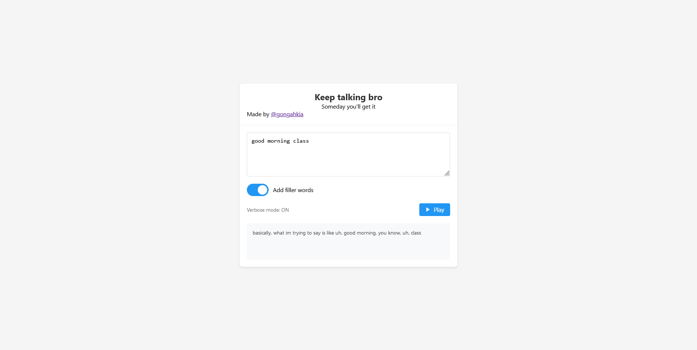

# `Keep talking bro`

Make and listen to verbose sentences in the browser.

## Screenshot



## Usage

```console
$ git clone https://github.com/gongahkia/the-sandbox
$ cd javascript/keepTalkingBro
$ npm install -g http-server
$ http-server
```