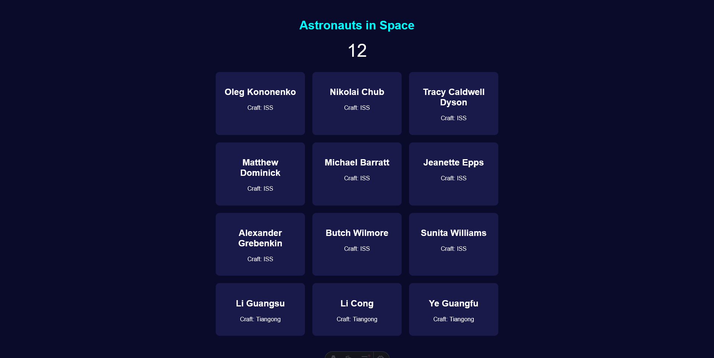

# Learning Astro

Simple web app that uses the Open Notify [People-In-Space](http://open-notify.org/Open-Notify-API/People-In-Space/) API.

## Usage

```console
$ cd people-in-space
$ npm i
$ npm start
```

