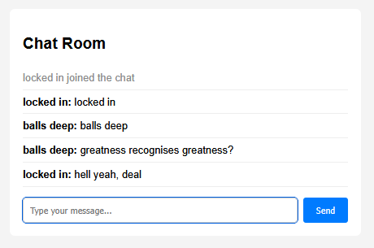

# Learning [Express](https://expressjs.com/)

To build a simple chat app with [Socket.IO](https://socket.io/get-started/chat) with username storage.

## Usage

```console
$ node index.js
```

## Screenshot

