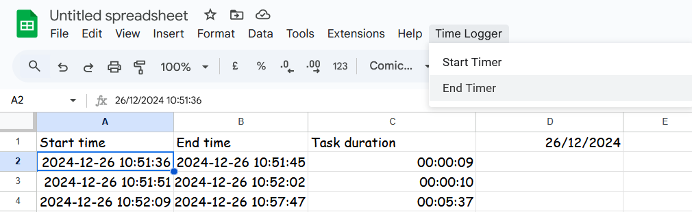
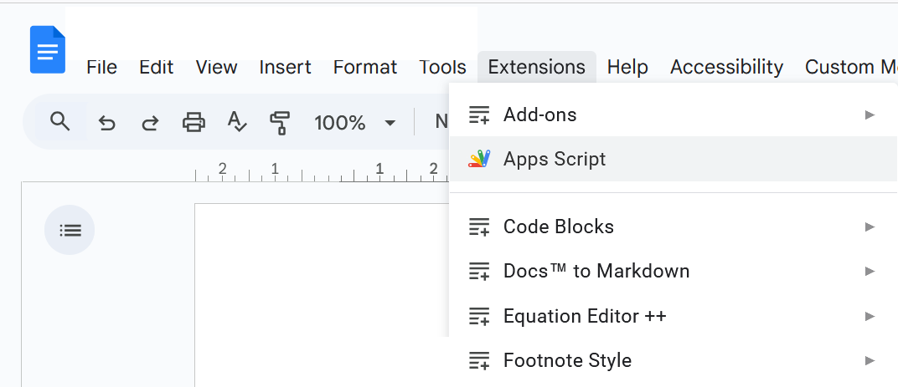
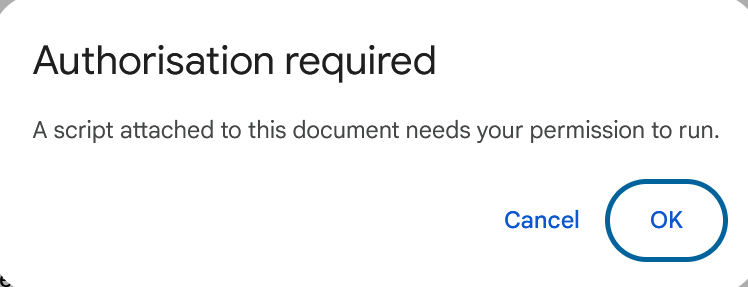
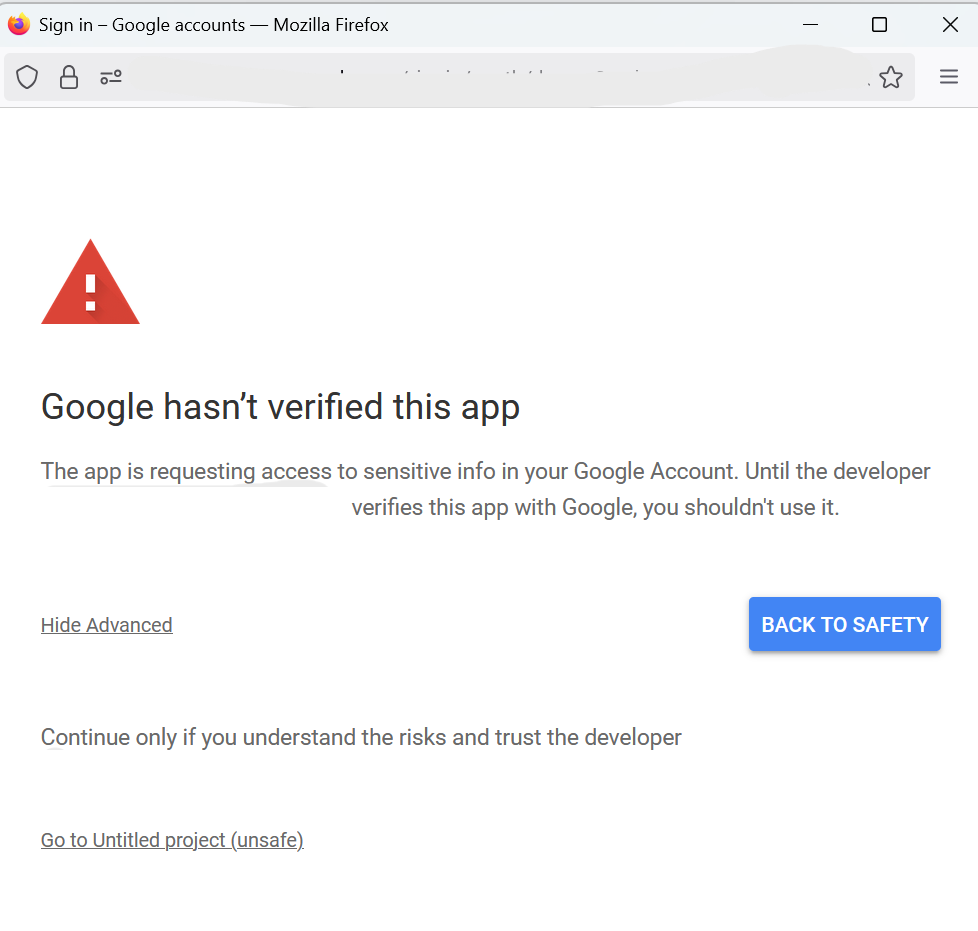
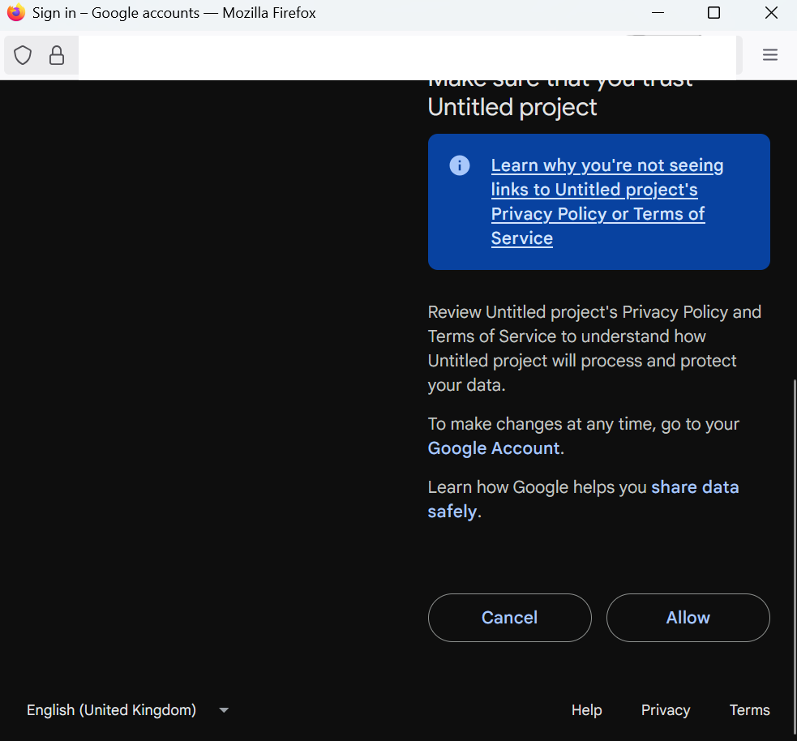

# `Moinet sheets extension`

Making time logging in Google Sheets convenient.

In honor of [Louis Moinet](https://en.wikipedia.org/wiki/Louis_Moinet) who invented the high-frequency stopwatch.

## Usage

1. Open [google suite](https://workspace.google.com/) application.
2. Select `Extensions > Apps Script`.

3. Replace the code in `Code.gs`.

5. `Ctrl + s` to save the project.
6. Select `Run`.
7. Select `OK` to give permissions.

8. Choose a Google Account to associate with the script.

9. Select `Show Advanced > Go to project_name (unsafe)`.

10. Select `Allow`.

