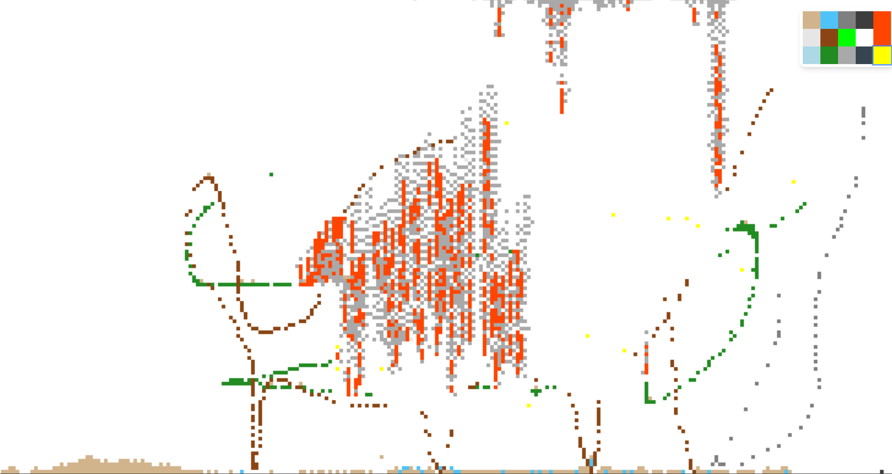

# Particle sandbox

Supports 15 unique particles - sand, water, stone, oil, fire, steam, wood, acid, salt, lava, ice, plant, smoke, gunpowder and electricity.

## Usage

```console
$ npm install http-server -g
$ http-server -o index.html
```

## Screenshots


