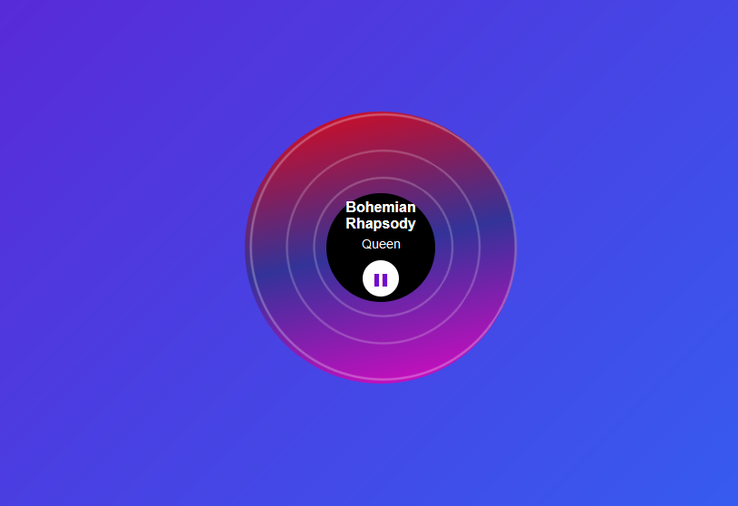

# Vinyl in the browser done three ways

In pure HTML, CSS and JS.

```console
$ npm install http-server -g
$ http-server -o vinyl-one.html
$ http-server -o vinyl-two.html
$ http-server -o vinyl-three.html
```

## Screenshots


