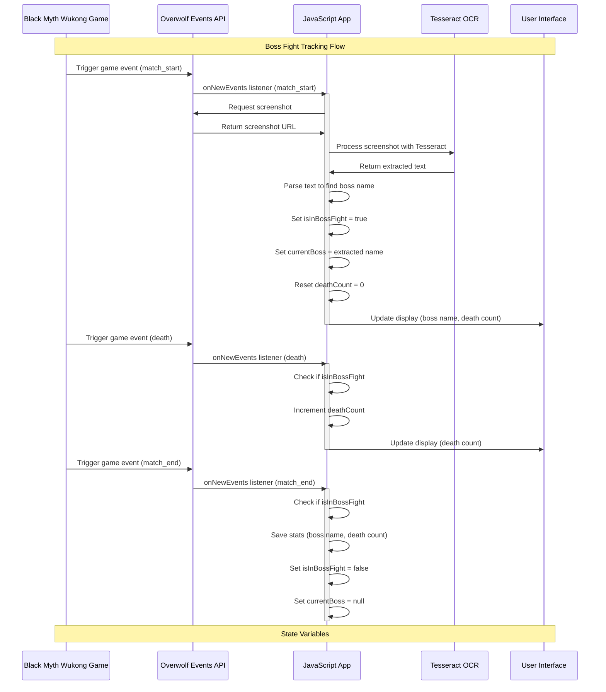

# Wukong Death Tracker

Tracks your deaths, dodges and utilities in [Black Myth Wukong](https://store.steampowered.com/app/2358720/Black_Myth_Wukong/).

For me to learn how to use [Overwolf SDK](https://dev.overwolf.com/ow-native/getting-started/overview/).

Uses Overwolf's event definitions for BMW per [here](https://dev.overwolf.com/ow-native/live-game-data-gep/supported-games/black-myth-wukong/?game-tab=docs).

Uses OCR to extract the Bossname and a hardcoded timer to track the dodge recharge.

## Architecture

