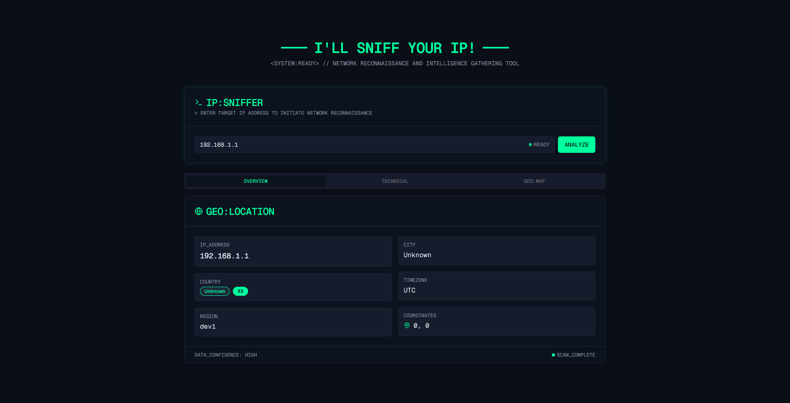
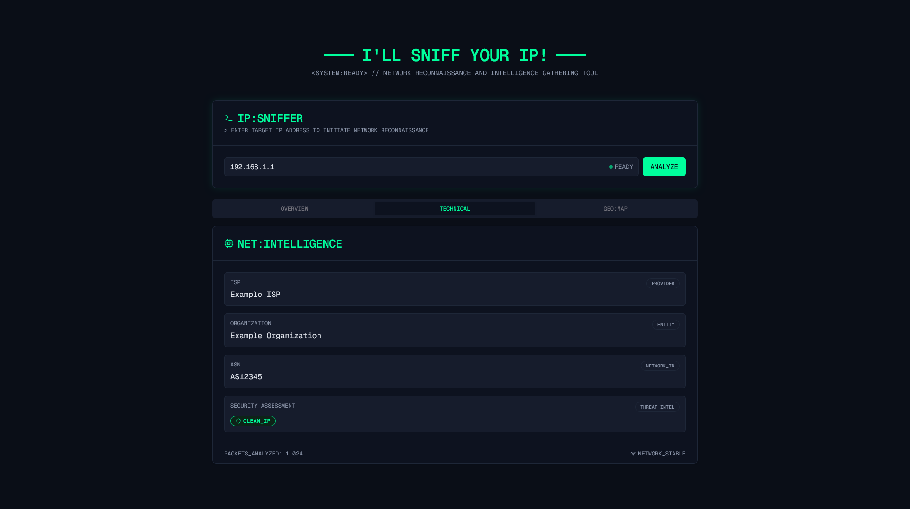

# I'll Sniff your IP

Simple Next.js Frontend that calls the [IP API](https://ip-api.com/) and the browser's default [Geolocation API](https://developer.mozilla.org/en-US/docs/Web/API/Geolocation_API).

