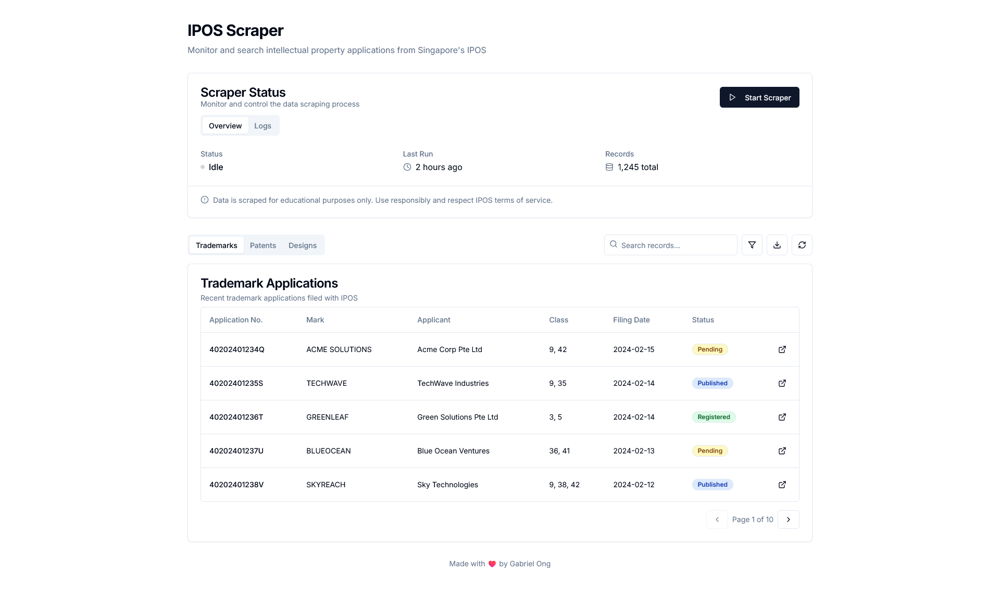
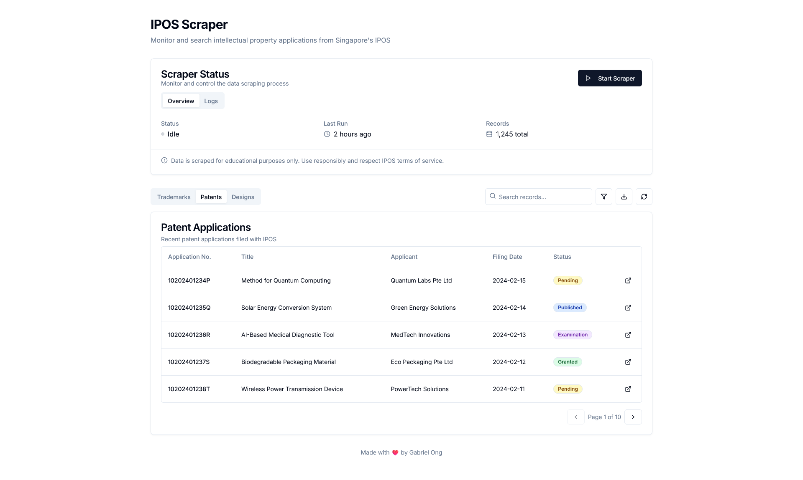
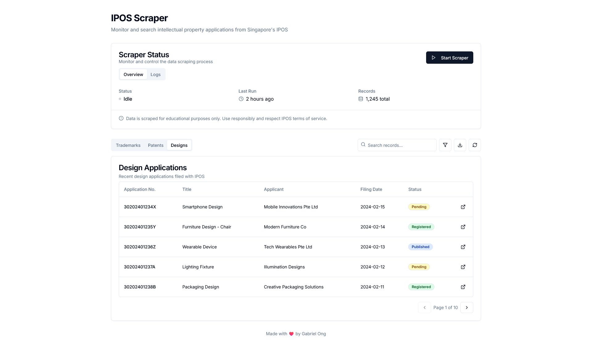
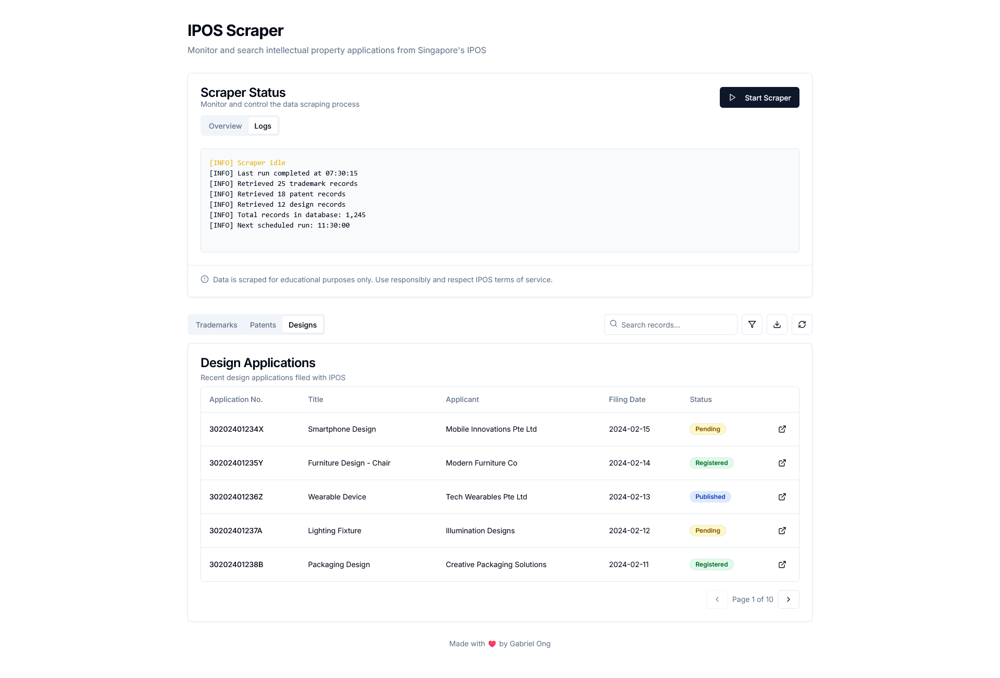
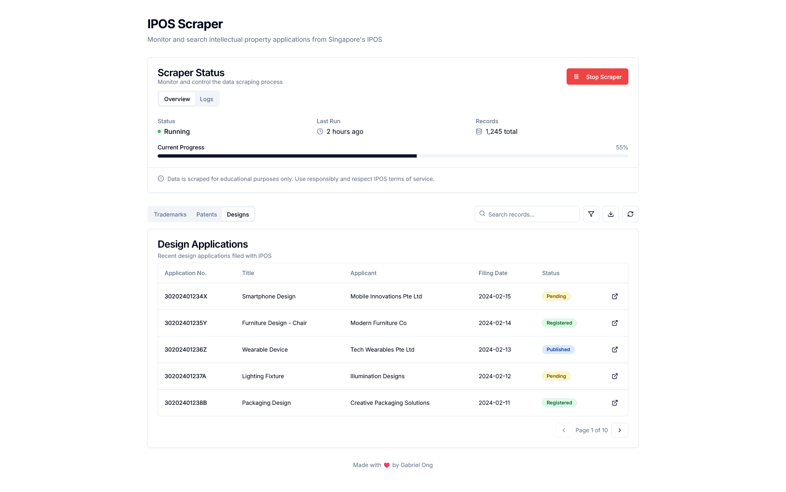

# IPOS Scraper

[Next.js](https://nextjs.org/) frontend application that (**will eventually**) scrape the [ipos.gov.sg](https://www.ipos.gov.sg/) website for the following.

* Design applications
* Patent applications 
* Trademark applications
* IPOS search and enquiry
* IPOS existing trademarks
* IPOS existing designs 
* IPOS existing patents

Right now it uses hardcoded values.

## Usage

```console
$ cd src/ipos-scraper
$ npm i
$ npm run dev
```

## Screenshots





