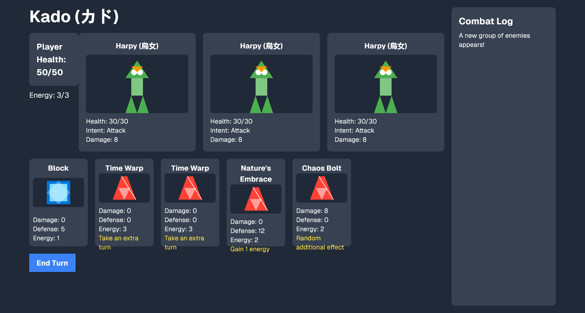
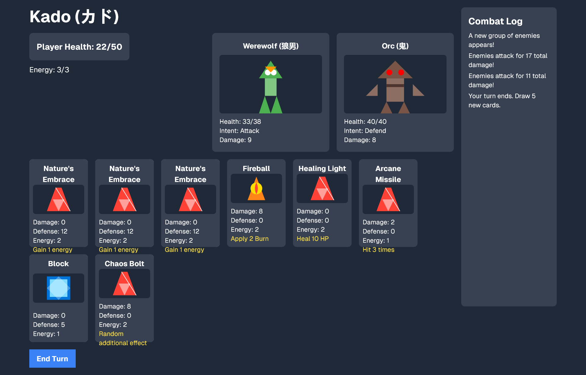

# `Kado`

Slay the spire clone with randomised encounters and synergistic combos.

Made with React, Next.js and Tailwind CSS.


## Screenshot




## Usage

```console
$ cd src/kado
$ npm install framer-motion @react-three/drei @react-three/fiber three
$ npm run dev
```