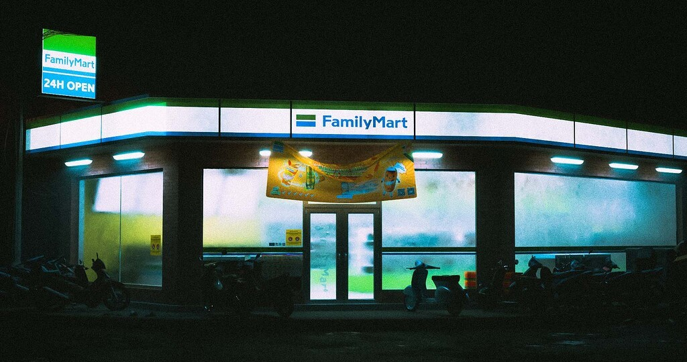
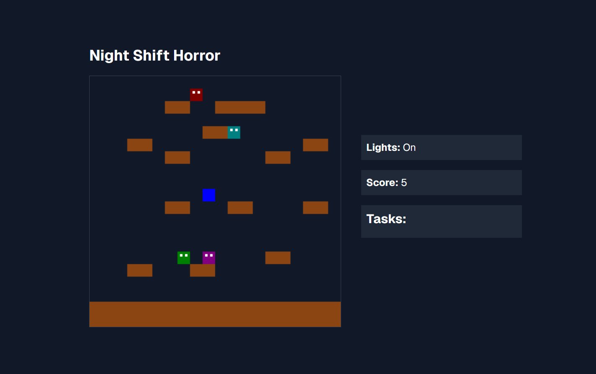

# `konbini`

<p align="center">

</p>

Small browser horror game written in React, Next.js and Tailwind CSS.



## Usage

```py
$ cd src/konbini
$ npm install @radix-ui/react-slot class-variance-authority clsx tailwind-merge lucide-react
$ npm run dev
```