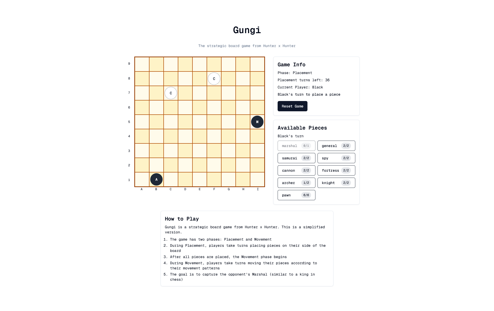

# `Komugi`

Simple Next.js frontend that provides a Gungi implementation. 

## Usage

```console
$ cd komugi-app
$ npm i && npm run dev
```

## Screenshots



## Reference

The name `Komugi` is in reference to the World [Gungi](https://hunterxhunter.fandom.com/wiki/Gungi) Champion [Komugi](https://hunterxhunter.fandom.com/wiki/Komugi) (コムギ) from the ongoing manga series [Hunter x Hunter](https://hunterxhunter.fandom.com/wiki/Hunterpedia).

