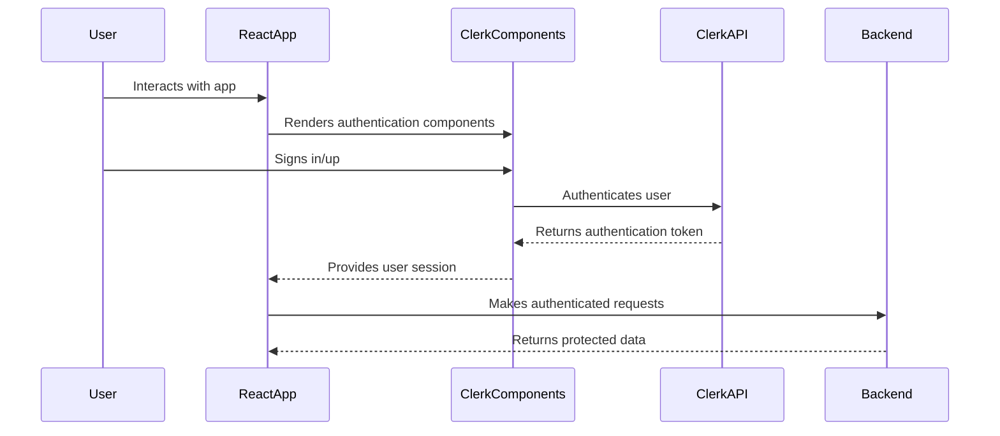

# `learning_clerk`

[Clerk](https://clerk.com/) helps you implement authentication as a plug-and-play component in your frontend projects.

Below is an example app that implements Clerk's sign up and profile management.

## Architecture 



## Usage

1. Place your clerk token within `.env.local`.

```env
NEXT_PUBLIC_CLERK_PUBLISHABLE_KEY=XXX
CLERK_SECRET_KEY=XXX
```

2. Run the following.

```console
$ cd src/example
$ npm install @clerk/nextjs
$ npm run dev
```

3. Use the test account email, phone number and verification code provided by Clerk to sign up and sign in.
