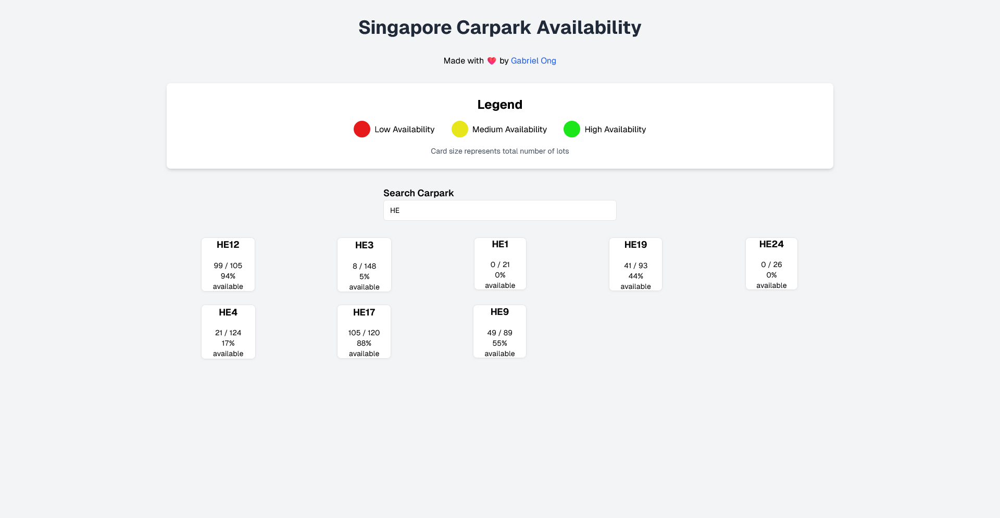
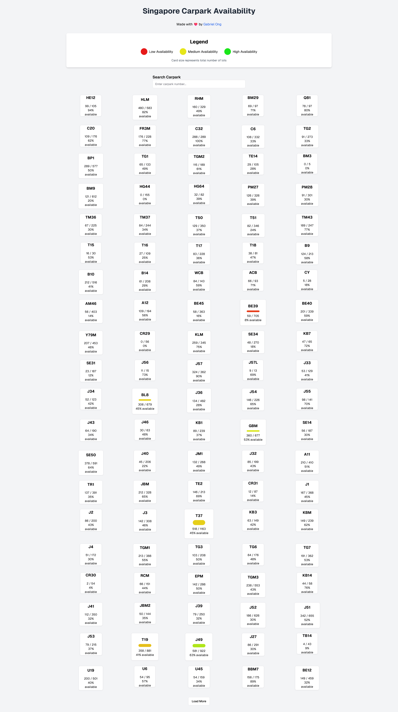

# Par Cark

[Next.js](https://nextjs.org/) frontend application that calls Singapore's [Carpark Availability API](https://data.gov.sg/datasets?formats=API&sort=relevancy&page=1&query=carpark&resultId=d_ca933a644e55d34fe21f28b8052fac63#tag/default/GET/technology/ipos/trademarks) maintained by [data.gov.sg](https://data.gov.sg/).

Ships with smooth animations, intuitive visualisations and a search that just works.

## Usage

```console
$ cd src/par-cark
$ npm i
$ npm run dev
```

## Screenshots


