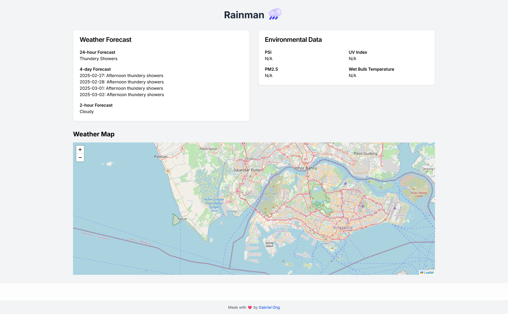

# Rain Man

[Next.js](https://nextjs.org/) frontend application that calls the following APIs maintained by [data.gov.sg](https://data.gov.sg/).

* 24-hr weather forecast API
* 4-day weather forecas API
* 2-hr weather forecas API
* PSI levels API
* UV index API
* Windspeed across Singapore API
* Wind direction across Singapore API
* Rainfall across Singapore API
* Relative Humidity across Singapore API
* Air temp across Singapore API
* PM2.5 API
* Wet Bulb Globe Temperature Observations API
* Lightning Observation API

Ships with a flat aesthetic.

## Usage

```console
$ cd src/rain-man
$ npm i
$ npm run dev
```

## Screenshots

