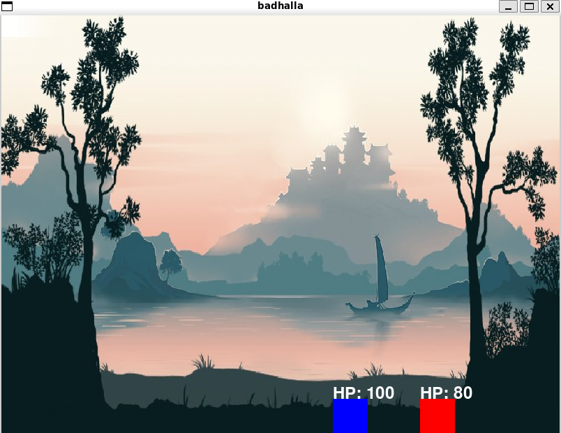
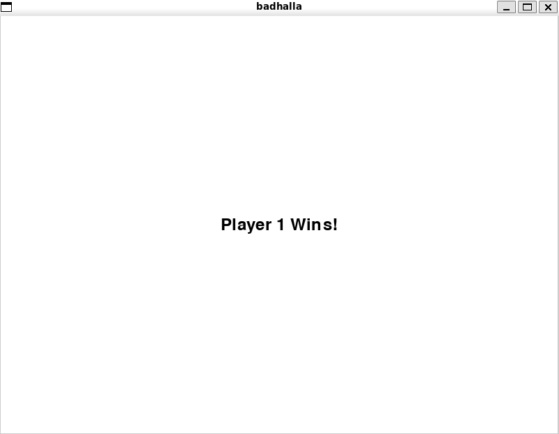

# `badhalla`

Single-file implementation of a multiplayer fighting game played on the same device.

The code here could also be used as a basic scaffold for any 2d fighting game.

## usage

```console
$ make config
$ make
```
## controls

| Action   | Player 1 Control | Player 2 Control |
|----------|-------------------|-------------------|
| Move Left| `A`               | Left Arrow (`←`)   |
| Move Right| `D`              | Right Arrow (`→`)  |
| Jump     | `W`               | Up Arrow (`↑`)     |
| Dodge    | `S`               | Down Arrow (`↓`)   |

## screenshots


