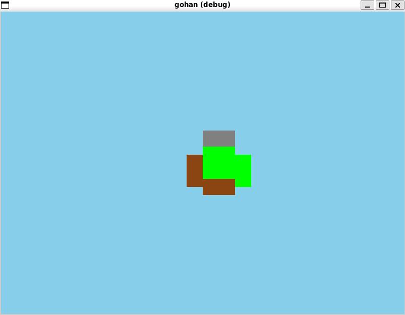
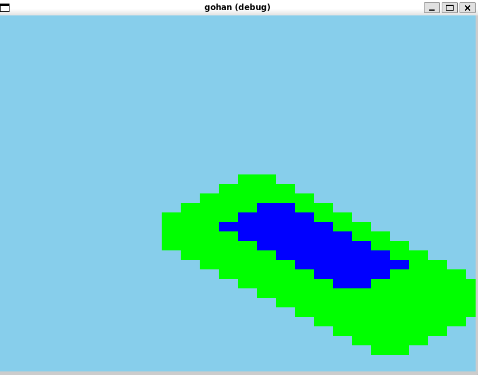
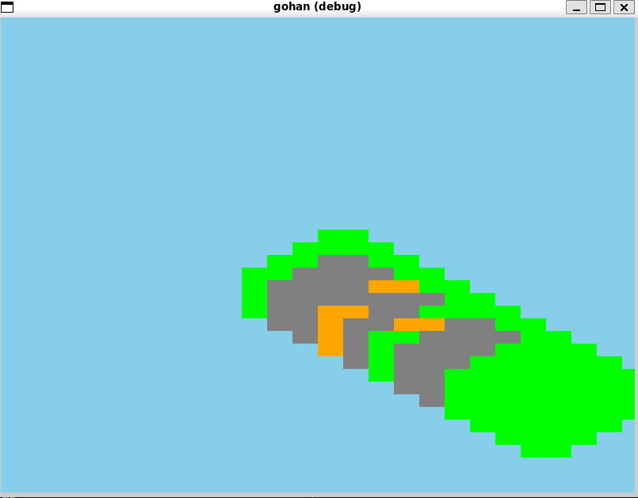

# `gohan`

Isometric from scratch.

## Screenshots

## References

The name `gohan` (ごはん) roughly translates to 'five and a half' in Japanese, a reference to the [Five and a Half Minute Hallway](https://house-of-leaves.fandom.com/wiki/Five_and_a_Half_Minute_Hallway) featured in the [ergodic](https://en.wikipedia.org/wiki/Ergodic_literature) novel [House of Leaves](https://en.wikipedia.org/wiki/House_of_Leaves) by [Mark Z. Danielewski](https://en.wikipedia.org/wiki/Mark_Z._Danielewski). 
