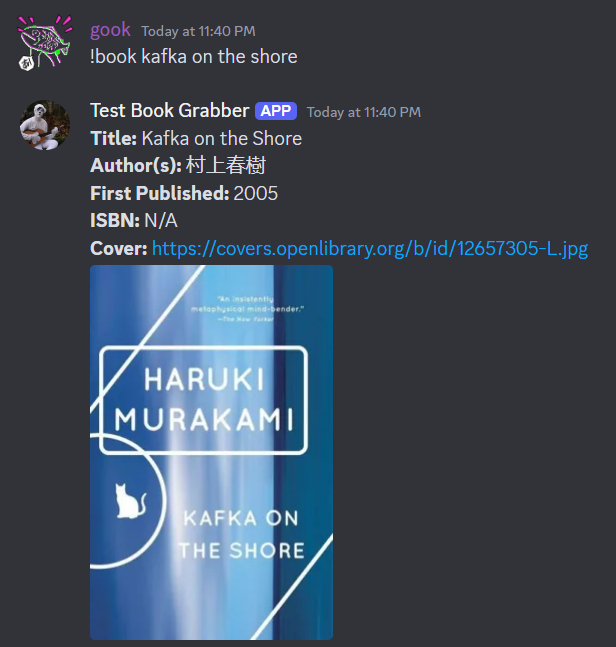

# Learning Discord Bots in Python

A simple librarian discord bot that uses [openlibrary API](https://openlibrary.org/).

**Search** for books with `!book <book_name>`.



## Local hosting

The bot below is locally hosted.

First, create a discord application [here](https://discord.com/developers/applications) and a bot for that application.

Also enable the relevant permissions under the Bot tab.

Next place your discord bot token in the `.env` file.

```env
DISCORD_TOKEN=XXX
```

Then run the below.

```console
$ python3 -m venv myenv
$ source myenv source/bin/activate
$ pip install discord.py requests python-dotenv 
$ python3 bot.py
```

## Deploying

Consider using the following.

* Google Cloud Platform
* Heroku
* DigitalOcean
* AWS Lambda
* AWS Elastic Beanstalk
* AWS EC2 instance

