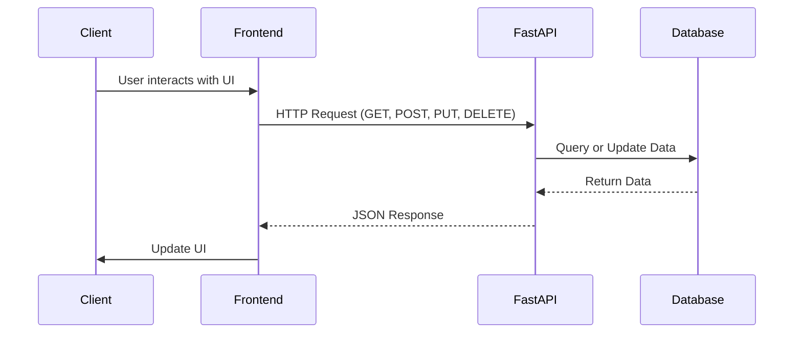

# `learning_fastAPI`

Experimenting with [FastAPI](https://fastapi.tiangolo.com/).

Made a naive extensible baseline for what the [five-seconds](https://github.com/gongahkia/five-seconds) API could look like.

## For my learning

* Modern web framework for building complete backends with out-of-the-box API endpoints + clean documentation in Python
* Built on top of Starlette and Pydantic
* Automatic generates API documentation with OpenAPI in the browser
* Leverages asynchronous programming with async and await, allowing it to handle multiple requests concurrently without blocking operations



## Usage

1. Run the following.

```console
$ python3 -m venv fastapi_env
$ source fastapi_env/bin/activate
$ pip install -r requirements.txt
```

2. Navigate to [`127.0.0.1:8000`](http://127.0.0.1:8000/docs) within your browser.
3. Interact with the endpoints.

```console
$ curl "http://127.0.0.1:8000/retrieve/hash1"
$ curl "http://127.0.0.1:8000/retrieve/non_existent_hash"
$ curl -X PUT "http://127.0.0.1:8000/store/hash4" -H "Content-Type: application/json" -d '{"value": "New Value for Hash 4"}'
```
