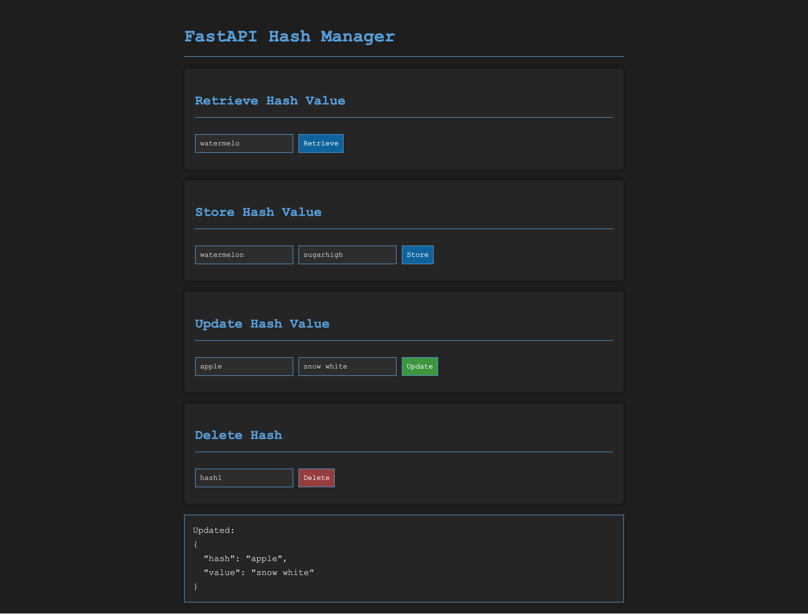
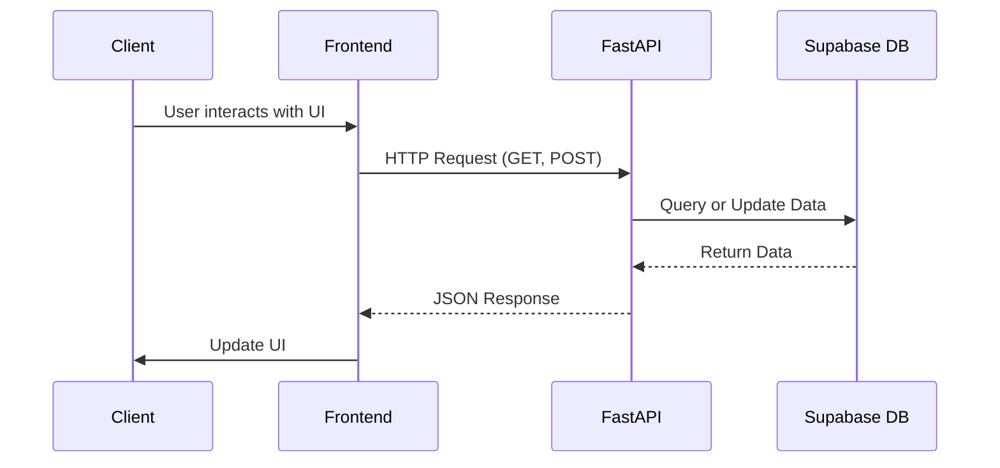

# `learning_fastapi_and_supabase`

Backend with [FastAPI](https://fastapi.tiangolo.com/).

Cloud hosted database with [Supabase](https://supabase.com/).

## Screenshot



## Arhitecture

* **DB** hosted with Supabase
* **Frontend** is `index.html`
* **FastAPI** is the backend code run within `app.py`



## For my learning

* Modern web framework for building complete backends with out-of-the-box API endpoints + clean documentation in Python
* Built on top of Starlette and Pydantic
* Automatic generates API documentation with FastAPI in the browser
* Leverages asynchronous programming with async and await, allowing it to handle multiple requests concurrently without blocking operations

## Usage

*For if you want to build this locally.*

1. Place the project password, supabase URL and supabase key into a local `.env` file.

```env
PROJECT_PASSWORD=XXX
SUPABASE_URL=XXX
SUPABASE_KEY=XXX
```

2. Run the following.

```console
$ python3 -m venv fastapi_env
$ source fastapi_env/bin/activate
$ pip install -r requirements.txt
```

3. Navigate to [`127.0.0.1:8000`](http://127.0.0.1:8000/docs) within your browser.
4. Interact with the endpoints.

```console
$ curl "http://127.0.0.1:8000/retrieve/hash1"
$ curl "http://127.0.0.1:8000/retrieve/non_existent_hash"
$ curl -X PUT "http://127.0.0.1:8000/store/hash4" -H "Content-Type: application/json" -d '{"value": "New Value for Hash 4"}'
```