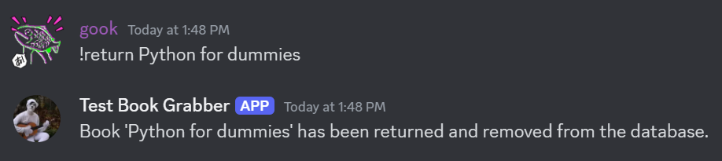

# Learning to write a Discord Bot that uses half a stack

*'Half a stack'* specifically refers to FastAPI and Supabase for DB integration.

Ideally a smarter, better-structured version of [`learning_discord_bot`](./../learning_discord_bot/).

## Commands

| Command | Description | Example |
| :--- | :--- | :---: |
| `!find <book title>` | searches for a book and displays its information without adding it to the database | |
| `!borrow <book title>` | searches for a book and adds it to the database |  |
| `!list` | lists all books currently in the database |  |
| `!return <book title>` | removes a book from the database |  |

## Architecture

### Overview


### DB structure


## Usage (local hosting)

The bot below is locally hosted.

First, create a discord application [here](https://discord.com/developers/applications) and a bot for that application.

Also enable the relevant permissions under the Bot tab.

Second, create a supabase table with the [`create.sql`](./create.sql) script.

Next place your discord bot token, supabase URL and supabase key in the `.env` file.

```env
DISCORD_TOKEN=XXX
SUPABASE_URL=XXX
SUPABASE_KEY=XXX
```

Then run the below.

```console
$ python3 -m venv myenv
$ source myenv source/bin/activate
$ pip install fastapi uvicorn supabase discord.py python-dotenv requests
$ python3 main.py
```

