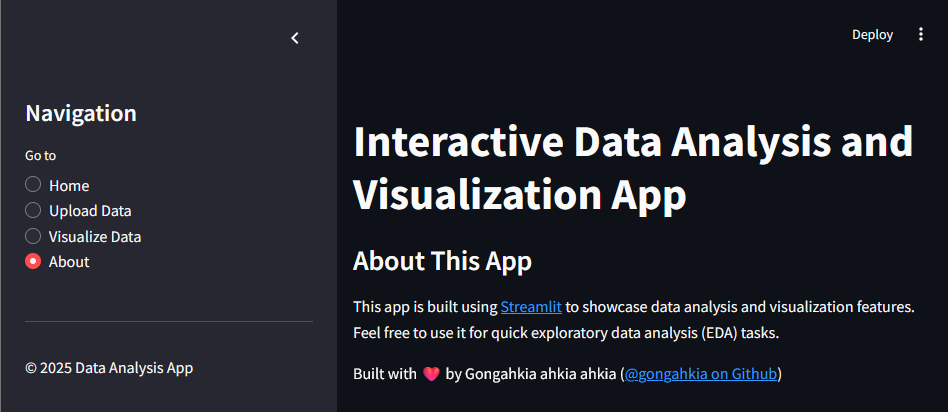

# `learning_streamlit`

Open-source Python framework for quickly building interactive and data-driven web applications.



## Usage

```console
$ pip install streamlit pandas numpy matplotlib seaborn
$ streamlit run app.py
```

## Why use Streamlit?

* No frontend experience required since everything is written in Python
* Detailed, responsive UI and widgets
* First-class integration with data visualisation libraries like Pandas, Matplotlib, Plotly
* HMR
* Easy, free deployment with Streamlit Cloud

## What do you use Streamlit for?

* Data visusalization
* ML demos
* Exploratory Data Analysis
* Reporting dashboards
* Custom app development