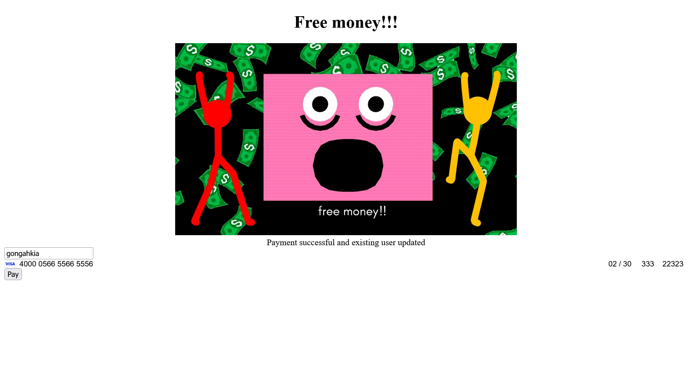
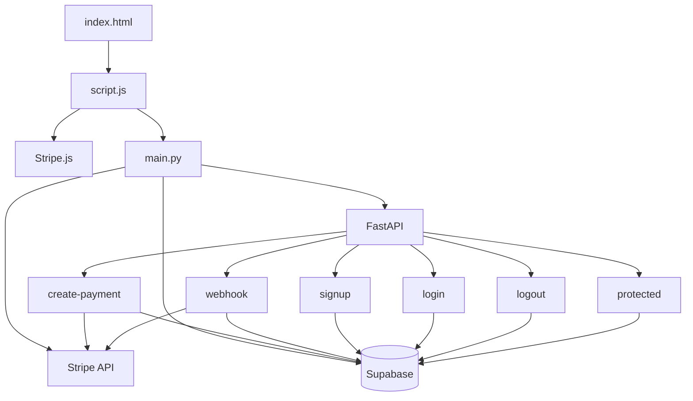
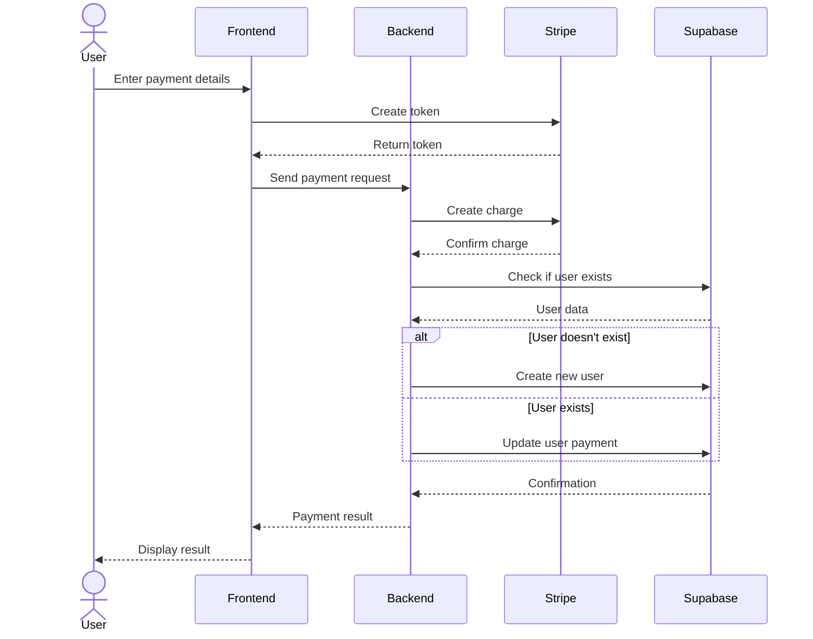
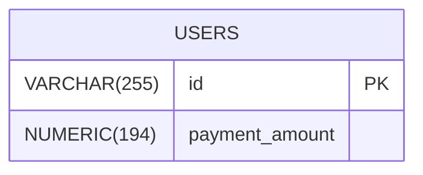

# Learning Stripe *(with FastAPI and Supabase)*

*The values in the 2 images below are **test data** given by stripe.*




## Usage via locally hosting

First store your stripe secret key, supabase URL and supabase key in a `.env` file.

```env
STRIPE_SECRET_KEY=XXX
SUPABASE_URL=XXX
SUPABASE_KEY=XXX
```

Next add your stripe publishable key to `script.js`.

```js
// other code above...

async function initializeStripe() {
    const publishableKey = "XXX" // add it here
    stripe = Stripe(publishableKey);
    const elements = stripe.elements();
    const cardElement = elements.create('card');
    cardElement.mount('#card-element');
}

// other code below...
```

Then create the supabase db with the [`create.sql`](./create.sql) file.

Then run the below.

```console
$ python3 -m venv myenv
$ sourc myenv/bin/activate
$ pip install fastapi uvicorn stripe supabase python-dotenv
$ python3 main.py
```

Use the [test card numbers](https://docs.stripe.com/testing#cards) provided by stripe.

## Architecture

### Overview

#### Structure



#### Sequence



### DB


