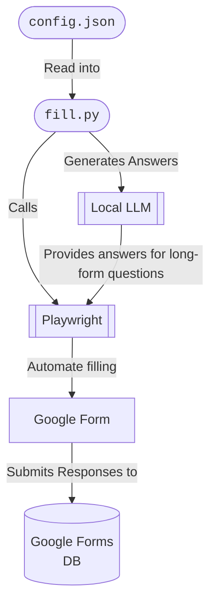

# `QuestionAIre`

Let an LLM fill out [google forms](https://docs.google.com/forms/) for you.

## Architecture



## Usage

1. Specify your forms filling configuration withi `config.json`.
2. Run the following commands.

```console
$ make config
$ make 
```