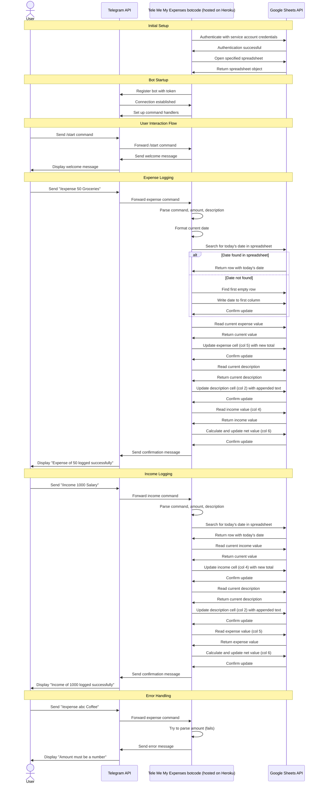

# Tele Me My Expenses

Telegram Bot for tracking your expenses and income that writes directly to a Google Sheets.

Bot code to be hosted on [Heroku](https://www.heroku.com/).

Usage requires creation of a populated `.env` file with the below details.

```env
TELEGRAM_TOKEN=XXX
GOOGLE_SHEET_NAME=XXX
GOOGLE_CREDENTIALS_FILE=XXX
```

## Architecture

