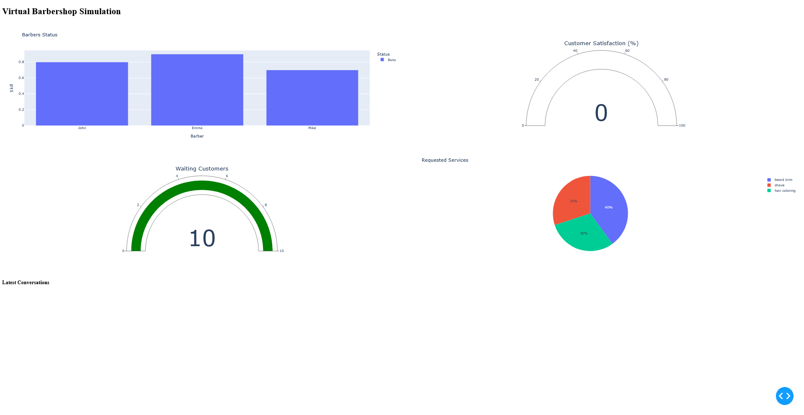

# `virtual-barbershop`

Creates, generates and visualises dynamic conversations in a nondescript barbershop with [ollama](https://ollama.com/).

```
$ python3 -m venv myenv
$ source myenv/bin/activate
$ pip install dash plotly pandas ollama
$ ollama pull llama2
$ python3 main.py
```

