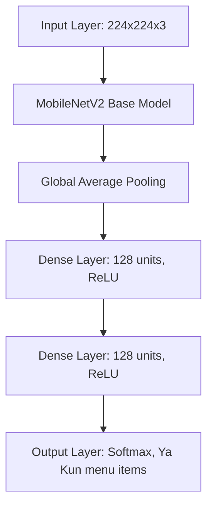

# `Yakun Menu Classifier` *(formerly `Uhh Kun`)* 🥤

Naive image classification model that sorts images into 1 of 2 categories.

1. **Ya Kun**: Image depicts a menu item from [Ya Kun](https://app.yakun.com/).
2. **No Kun**: Image does not depict a menu item from [Ya Kun](https://app.yakun.com/).

More [yapping](#other-comments).

## Usage


```console
$ python3 -m venv myenv
$ source myenv/bin/activate
$ make 
$ pip install -r requirements.txt
```

## Architecture



## Other comments

For consistency and standardisation, *"Ya Kun menu items"* for the purposes of this project were limited to those scraped from the [Ya Kun website](https://app.yakun.com/menu.html) as of 5:29pm on 28 January 2025.