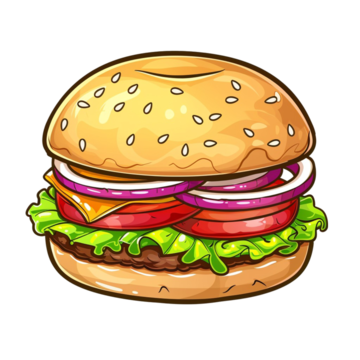

# `Krabby Vector`

Naive server for word to vector emebedding, written in [Rust](https://www.rust-lang.org/).

## Credit

Idea taken from a comment under [this](https://www.reddit.com/r/rust/comments/aofoj1/project_ideas_specifically_for_rust/) post.

## Reference

The name `Krabby Vector` is in reference to the [Krabby Patty](https://spongebob.fandom.com/wiki/Krabby_Patty), the [Krusty Krab](https://spongebob.fandom.com/wiki/Krusty_Krab)'s signature burger in the [Nickelodeon](https://spongebob.fandom.com/wiki/Nickelodeon) series [SpongeBob SquarePants](https://spongebob.fandom.com/wiki/SpongeBob_SquarePants_(series)).

