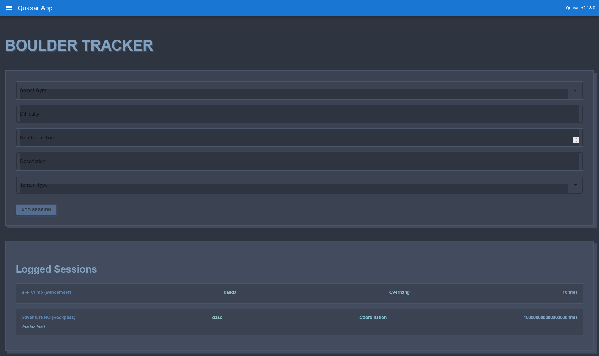

# Boulder shoulders

The obligatory frontend bouldering session tracking app, written in [Vue.js](https://vuejs.org/) and shipped with [Quasar](https://quasar.dev/).

Mostly learning this for an internship.

## Usage

```console
$ cd src/quasar-project
$ quasar dev
$ quasar mode add capacitor
$ quasar build -m capacitor -T android
$ quasar build -m capacitor -T ios
$ adb pair <device_ip_address>:<pairing_code>
$ adb connect <device_ip_address>:<pairing_code>
```

## Screenshots

