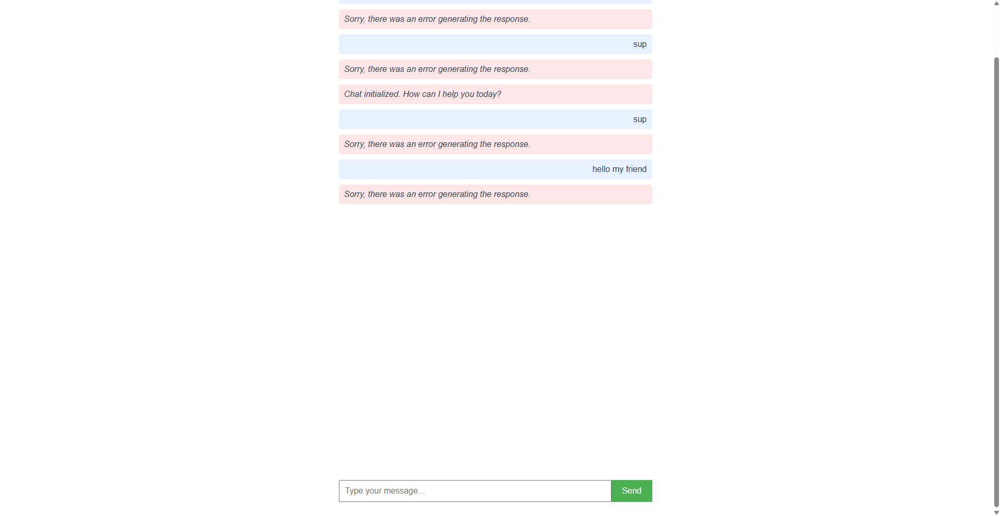

# Chat with me

[Vue.js](https://vuejs.org/) frontend web application that calls [WebLLM](https://webllm.mlc.ai/).

## Usage

First place OpenAI key in `.env` file.

```env
VITE_OPENAI_API_KEY=XXX
```

Then run.

```console
$ cd src/chat_with_me
$ npm install @langchain/community @mlc-ai/web-llm
$ npm install openai@^4.0.0
$ npm install @mlc-ai/web-llm
$ npm run serve
```

Then open [localhost:8080](http://localhost:8080/) in Google Chrome or Microsoft Edge.

## Screenshot

