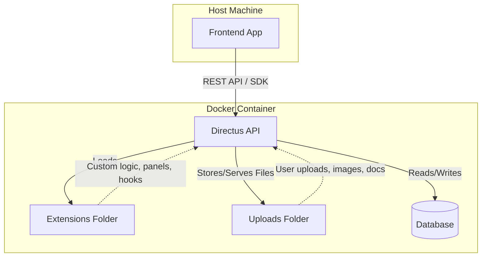

# Learning [Directus](https://directus.io/)

Serving a simple `pages` collection with Directus to a JavaScript frontend via the [Directus SDK](https://docs.directus.io/guides/sdk/getting-started).

## Usage

First run the below.

```console
$ sudo docker compose up
$ cd src && npm start
```

Then visit the frontend at [localhost:3000/about](http://localhost:3000/about) or [localhost:3000/contact](http://localhost:3000/contact)

You can also visit the Directus backend at [localhost:8055](http://localhost:8055).

## Architecture


