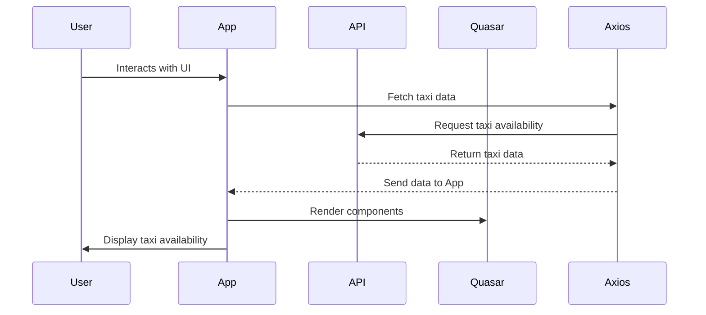

# Taxi Taxi Taxi

[Vue.js](https://vuejs.org/) frontend application that calls Singapore's [Taxi Availability API](https://data.gov.sg/datasets?formats=API&sort=relevancy&page=1&resultId=d_e25662f1a062dd046453926aa284ba64#tag/default/GET/technology/ipos/trademarks) maintained by [data.gov.sg](https://data.gov.sg/).

Shipped with [Quasar](https://quasar.dev/).

## Usage

```console
$ cd src/taxi_taxi_taxi
$ npm install axios
$ npm install quasar @quasar/extras
$ npm install -D sass-loader@^10 sass
$ npm run serve
```

## Architecture

