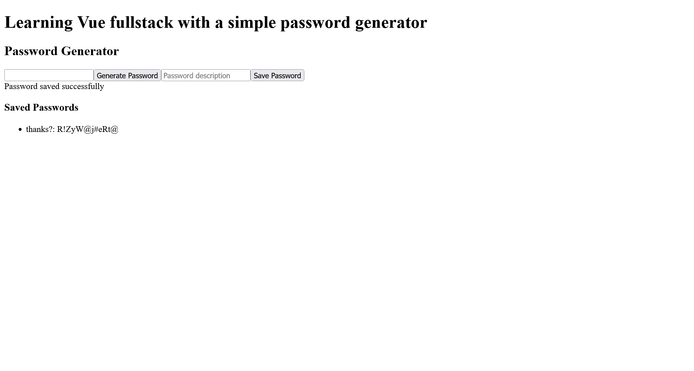
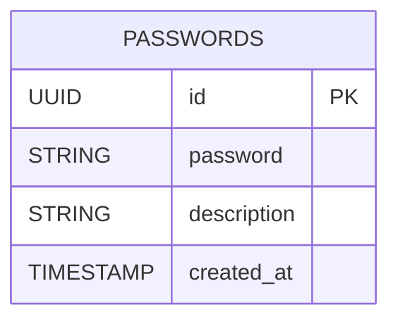
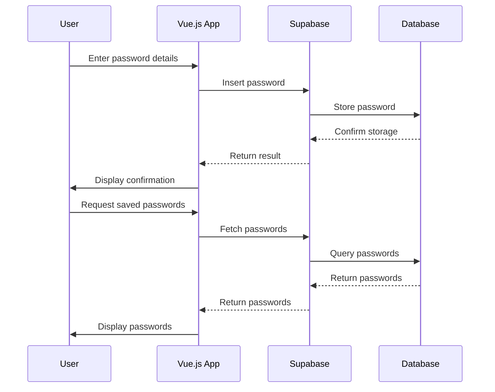

# Vue fullstack

Simple [Vue.js](https://vuejs.org/) fullstack web application that generates and saves your passwords to [Supabase](https://supabase.com/).



## Usage

Add your supabase url and supabase api key in a `.env` file.

```env
VITE_SUPABASE_URL=XXX
VITE_SUPABASE_ANON_KEY=XXX
```

Then run the below.

```console
$ npm install @supabase/supabase-js
$ npm run serve
```

## Architecture

### DB



### Overview

